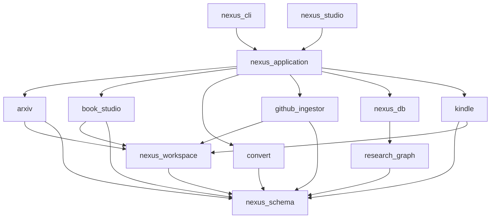

# Nexus Engine v1.0: Scientific Knowledge Engine — Roadmap (Rev. 4)

> **Vision**: A locally-run, offline-capable Scientific Knowledge Engine that ingests academic papers (arXiv), textbooks (PDF), and numerical code (GitHub/Zenodo) into a unified, graph-structured Knowledge Garden — browsable via a native desktop window, exportable to Kindle, and future-proof for RAG.

---

## 1. Guiding Architectural Principles

1. **Hexagonal Architecture (Strict `src`-layout)**: All packages conform to PEP 517 `src`-layout (`packages/<pkg>/src/<pkg>/{domain,services,infra}`) to guarantee isolated, unambiguous namespaces (e.g., `from book_studio.domain import ...`).
2. **Immutable Garden (Content Only)**: Markdown files in `$NEXUS_WORKSPACE/garden/` store only **immutable provenance fields** in YAML.
3. **SQLite is Derived & Rebuildable**: `nexus.db` holds all mutable operational state and can be fully reconstructed from `garden/` YAML files + `ledger/` JSONL files.
4. **Separation of Staging and Publishing**: Intermediate compilation artifacts (like OCR crops, stitched TEX) live in `$NEXUS_WORKSPACE/books/<slug>/`. Only the final, polished artifacts are published to `$NEXUS_WORKSPACE/garden/`.
5. **Idempotent Operations**: Every pipeline run checks SHA-256 file hashes before processing.

---

## 2. System Architecture

### 2a. Package Dependency Graph (DIP-Compliant UML: A --> B means A imports B)



---

## 3. Data Model

### 3a. SQLite Schema (`nexus_db`)

```sql
PRAGMA foreign_keys = ON;
PRAGMA journal_mode = WAL;

CREATE TABLE papers (
    id          TEXT PRIMARY KEY,
    arxiv_id    TEXT UNIQUE,
    doi         TEXT UNIQUE,
    s2_id       TEXT UNIQUE,
    title       TEXT NOT NULL,
    abstract    TEXT,
    published   DATE,
    venue       TEXT,
    garden_slug TEXT UNIQUE,
    status      TEXT NOT NULL DEFAULT 'stub',
    kindle_sent INTEGER DEFAULT 0,
    citation_count INTEGER,
    file_hash   TEXT,
    created_at  TIMESTAMP DEFAULT CURRENT_TIMESTAMP,
    updated_at  TIMESTAMP DEFAULT CURRENT_TIMESTAMP
);

CREATE TABLE citations (
    citing_id  TEXT REFERENCES papers(id) ON DELETE CASCADE,
    cited_id   TEXT REFERENCES papers(id) ON DELETE CASCADE,
    source     TEXT NOT NULL,
    confidence REAL DEFAULT 1.0,
    PRIMARY KEY (citing_id, cited_id)
);

CREATE VIRTUAL TABLE garden_fts USING fts5(
    paper_id UNINDEXED,
    file_path UNINDEXED,
    section_title,
    body,
    latex_tokens,
    tokenize = "unicode61 remove_diacritics 2 tokenchars '\_^'"
);
```

### 3b. Ledger & Staging Layout (`nexus-workspace`)

```
$NEXUS_WORKSPACE/
├── raw/                      # Immutable inputs (PDFs, tarballs) tracked by DVC
├── books/<slug>/             # Intermediate staging for book_studio (00_raw to 06_compiled)
├── ledger/
│   ├── catalog.jsonl         # Stub/metadata registry to satisfy NOT NULL SQLite constraints
│   ├── citations.jsonl       # Append-only edge insertions
│   └── status.jsonl          # State transitions
├── garden/                   # Published, Obsidian-ready notes
│   ├── papers/
│   ├── books/
│   ├── repos/
│   └── atomic/
├── exports/kindle/           # Generated EPUB/MOBI files
└── state/                    # Idempotent workflow ledgers
```

---

## 4. Phased Roadmap

### Sprint 0: Structural Debt Cleanup (Critical Blocker)
| # | Task | Action |
|---|------|--------|
| 0.1 | **Lock Namespace & Promote `research_graph` + Scaffold `nexus_db`** | Extract `research_graph` to top-level, adopting `src/research_graph/{domain,services,infra}`. Scaffold `nexus_db` with `schema.py`, `repository.py`, `uow.py`. Move `obsidian.py` to `nexus_workspace`. |
| 0.2 | **Deduplicate `packages/arxiv/**` | Diff and merge root vs `src/` and `test/` vs `tests/` across submodules. Resolve `orchestrator` duplicates and `agentic_orchestrator` splits. Archive `api`, `automation`, `front`, and delete root scratch files. |
| 0.3 | **Refactor `book_studio` & `convert`** | Deduplicate `assembler`, `stitcher`, `extractor` in `book_studio/book_studio/` and adopt `src/book_studio/{domain,services,infra}` layout. Standardize `app_spatial_compiler`. Delete duplicate `convert/.agents/`. |
| 0.4 | **Align `nexus-workspace` Layout** | Scaffold `garden/`, `raw/`, `ledger/`, `exports/`, `state/`. Remove unused `data/02_*`–`07_*`. Keep `books/<slug>/` as staging, publish to `garden/books/<slug>/`. |

### Sprint 1: Foundation Wiring
| # | Task | Details |
|---|------|---------|
| 1.1 | **Initialize `nexus_db`** | Alembic migrations, `aiosqlite` async session. |
| 1.2 | **Build `nexus_application`** | Core orchestrator use-cases (IngestArxiv, ExportKindle). |
| 1.3 | **Wire CLI** | Remove mocks in `nexus_cli`. |
| 1.4 | **Resilience** | `nexus init` and `nexus db rebuild` (using `catalog.jsonl`). |

### Sprint 2: LaTeX Intelligence & Domain Core
| # | Task | Details |
|---|------|---------|
| 2.1 | **Equation Token Masking** | Shared domain service mapping `$$...$$` to `__MATH_BLOCK_N__` before LLM inference. |
| 2.2 | **LaTeX Flattener (Stage 1)** | `latexpand` infra adapter to resolve `\input`/`\include` and strip `%` comments. |
| 2.3 | **LaTeX Flattener (Stage 2)** | Parse preamble for `\def`, `\newcommand` and apply them globally. |
| 2.4 | **LaTeX Flattener (Stage 3)** | `pylatexenc` AST walker rewrites `\over → \frac`, `eqnarray → align`. |

*(Sprints 3-7 remain unchanged: ArXiv Citation Intelligence, OCR Benchmark, GUI Foundation, GitHub Ingestor, Atomic Knowledge Synthesis)*
