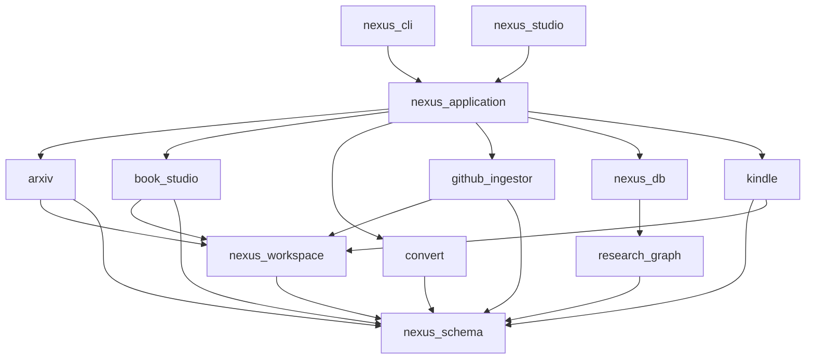

# Nexus Engine v1.0: Scientific Knowledge Engine — Roadmap (Rev. 3)

> **Vision**: A locally-run, offline-capable Scientific Knowledge Engine that ingests academic papers (arXiv), textbooks (PDF), and numerical code (GitHub/Zenodo) into a unified, graph-structured Knowledge Garden — browsable via a native desktop window, exportable to Kindle, and future-proof for RAG.

---

## 1. Guiding Architectural Principles

1. **Hexagonal Architecture**: All I/O (files, APIs, SQLite, UI) is isolated in `/infra` or `/adapters`. Domain logic acts as pure morphisms (`RawSource → Result[CanonicalAST, DomainError]`).
2. **Immutable Garden (Content Only)**: Markdown files in `$NEXUS_WORKSPACE/garden/` store only **immutable provenance fields** in YAML. They are never overwritten by operational state.
3. **SQLite is Derived & Rebuildable**: `nexus.db` holds all mutable operational state. It can be fully reconstructed from `garden/` YAML files + `ledger/` JSONL files.
4. **Single Source of Truth**: Content provenance → `garden/*.md`. Operational state → `nexus.db`. Raw audit log / un-ingested metadata → `ledger/catalog.jsonl` & `citations.jsonl`.
5. **Idempotent Operations**: Every pipeline run checks SHA-256 file hashes before processing.

---

## 2. System Architecture

### 2a. Package Dependency Graph (DIP-Compliant UML: A --> B means A imports B)



### 2b. Full Stack Layers

```
┌────────────────────────────────────────────────────────────────────┐
│  DESKTOP WINDOW (PyWebView — frameless, sandboxed, port=OS-assigned)│
│  ┌─────────────────────────────────────────────────────────────┐  │
│  │  React + Vite SPA (Tailwind, KaTeX, react-force-graph-2d)   │  │
│  │  ↕ REST + WebSocket                                          │  │
│  │  FastAPI (aiosqlite, ProcessPoolExecutor for ingestion)      │  │
│  └─────────────────────────────────────────────────────────────┘  │
└───────────────────────────────┬────────────────────────────────────┘
                                │
              nexus_application (orchestration use-cases)
                                │
         ┌──────────┬───────────┼───────────┬──────────┐
         ▼          ▼           ▼           ▼          ▼
       arxiv   book_studio  github_      kindle     nexus_db
                            ingestor              (SQLite + FTS5)
         │          │                                  │
         ▼          ▼                                  ▼
      convert    convert                         research_graph
      (Latex)     (PDF)                         (pure algorithms)
                                │
                         nexus_schema
                        nexus_workspace
```

---

## 3. Data Model

### 3a. SQLite Schema (`nexus_db`)

```sql
PRAGMA foreign_keys = ON;
PRAGMA journal_mode = WAL;

CREATE TABLE papers (
    id          TEXT PRIMARY KEY,   -- "arxiv:cond-mat/9805275", "doi:...", "s2:..."
    arxiv_id    TEXT UNIQUE,
    doi         TEXT UNIQUE,
    s2_id       TEXT UNIQUE,
    title       TEXT NOT NULL,
    abstract    TEXT,
    published   DATE,
    venue       TEXT,
    garden_slug TEXT UNIQUE,        -- Relative path fragment, NULL for stubs
    status      TEXT NOT NULL DEFAULT 'stub',
    kindle_sent INTEGER DEFAULT 0,
    citation_count INTEGER,
    file_hash   TEXT,
    created_at  TIMESTAMP DEFAULT CURRENT_TIMESTAMP,
    updated_at  TIMESTAMP DEFAULT CURRENT_TIMESTAMP
);

CREATE TABLE citations (
    citing_id  TEXT REFERENCES papers(id) ON DELETE CASCADE,
    cited_id   TEXT REFERENCES papers(id) ON DELETE CASCADE,
    source     TEXT NOT NULL,
    confidence REAL DEFAULT 1.0,
    PRIMARY KEY (citing_id, cited_id)
);

CREATE VIRTUAL TABLE garden_fts USING fts5(
    paper_id UNINDEXED,
    file_path UNINDEXED,
    section_title,
    body,
    latex_tokens,
    tokenize = "unicode61 remove_diacritics 2 tokenchars '\_^'"
);
```

### 3b. Ledger (Append-Only Audit Log)
To ensure `nexus db rebuild` survives without violating `papers.title NOT NULL` for un-ingested items:
```
$NEXUS_WORKSPACE/ledger/
├── catalog.jsonl        # {"id": "arxiv:...", "title": "...", "authors": [...], "ts": "..."}
├── citations.jsonl      # {"citing": "arxiv:...", "cited": "doi:...", "source": "s2", "ts": "..."}
└── status.jsonl         # {"id": "arxiv:...", "old": "discovered", "new": "ingested", "ts": "..."}
```

---

## 4. Phased Roadmap

### Sprint 0: Structural Debt Cleanup (Critical Blocker)
| # | Task | Action |
|---|------|--------|
| 0.1 | `research_graph` Promotion | Move `packages/arxiv/research_graph` to `packages/research_graph` (pure domain algorithms). Move its `schema.py`, `repository.py`, `uow.py` to `nexus_db`. Move `obsidian.py` to `nexus_workspace`. Archive `chroma_adapter.py`. Move `external_apis.py` to `arxiv` (or `nexus_application`). |
| 0.2 | `book_studio` Consolidation | Refactor `packages/book_studio/src/` into standard `src/{domain,services,infra}` + `tests/`. Deduplicate `assembler.py`, `stitcher.py`, `extractor.py` (merge logic, keep 1 copy). |
| 0.3 | `arxiv` Duplicate Merge | For 4 submodules (`document_converter`, `document_processor`, `ingestion_engine`, `orchestrator`): Run `git diff --no-index` between root-level `adapters/`, `infra/` etc. and `src/` to merge diverging logic. Delete root-level copies. Merge `test/` into `tests/`. |
| 0.4 | `arxiv` Legacy Archival | Archive/delete `api/`, `automation/`, `front/` (Textual TUI), as they are superseded by `nexus_cli` and `nexus_studio`. Move `common/` into `nexus_application` or delete if unused. |
| 0.5 | `app_spatial_compiler` Rename | Rename `application/` → `services/` and `infrastructure/` → `infra/` in `packages/convert`. |
| 0.6 | Full Green Pass | `uv run pytest packages/` must pass completely. |

### Sprint 1: Foundation Wiring
| # | Task | Package |
|---|------|---------|
| 1.1 | Initialize `nexus_db` schema + Alembic migrations | `nexus_db` |
| 1.2 | Build `nexus_application` orchestrator use-cases | `nexus_application` |
| 1.3 | Wire `nexus_cli` to `nexus_application` (remove all mocks) | `nexus_cli` |
| 1.4 | Implement `nexus init` and `nexus db rebuild` (using `catalog.jsonl`) | `nexus_cli`, `nexus_db` |

### Sprint 2: LaTeX Intelligence & Domain Core
| # | Task | Details |
|---|------|---------|
| 2.1 | **Equation Token Masking** | Shared domain service: Masks `$$...$$` to `__MATH_BLOCK_N__` prior to LLM runs to protect physics formulas from corruption. |
| 2.2 | **LaTeX Flattener (Stage 1)** | `latexpand` infra adapter to resolve `\input`/`\include` and strip `%` comments. |
| 2.3 | **LaTeX Flattener (Stage 2)** | Custom Macro Expander: Parses preamble for `\def`, `\newcommand` and applies them globally across the document. |
| 2.4 | **LaTeX Flattener (Stage 3)** | Primitive Normalization: `pylatexenc` AST walker rewrites `\over → \frac`, `eqnarray → align`. |

### Sprint 3: ArXiv Citation Intelligence
| # | Task | Details |
|---|------|---------|
| 3.1 | **Semantic Scholar Batch API** | `POST /graph/v1/paper/batch` (500 IDs/req) to prevent rate limit lockouts. |
| 3.2 | **OpenAlex Fallback API** | Secondary unauthenticated fallback for DOI/Metadata resolution. |
| 3.3 | **Citation Builder** | Inserts `stub` entries to `catalog.jsonl` prior to linking citations to preserve SQLite FKs. |

### Sprint 4: OCR Benchmark & PDF Pipeline
| # | Task | Details |
|---|------|---------|
| 4.1 | **Benchmark Tool** | `nexus benchmark pdf fazekas --pages 10`. Estimates VRAM, time, token usage. |
| 4.2 | **Cross-Page Stitcher** | Merges split MathJax equations recursively. |

### Sprint 5: Desktop GUI Foundation (`nexus_studio`)
| # | Task | Details |
|---|------|---------|
| 5.1 | **PyWebView + FastAPI Setup** | Uvicorn binds to `127.0.0.1:0`. Asyncio DB isolation. WebSocket logs. |
| 5.2 | **Dashboard & Garden Viewer** | React + Vite + Tailwind + `rehype-katex`. Full Text Search across FTS5. |
| 5.3 | **Graph Visualizer** | HTML5 Canvas-based (e.g. `react-force-graph-2d`). Prunes 2nd-degree nodes via co-citation filtering ($k \ge 2$, capped at 500 nodes). |

### Sprint 6: GitHub Repository Ingestor
| # | Task | Details |
|---|------|---------|
| 6.1 | **Tree-sitter Language Queries** | Specific `.scm` for Python, Fortran, C++ targeting matrix/tensor operators. |
| 6.2 | **Code Summarizer** | Extracts 1-hop call contexts and prompts local LLMs. |

### Sprint 7: Atomic Knowledge Synthesis
| # | Task | Details |
|---|------|---------|
| 7.1 | **Section Summarizer** | Local LLM rewrites focused sections utilizing Pydantic structured grammars. |
| 7.2 | **Deterministic Wikilinker** | Aho-Corasick matching against existing Garden concepts (replaces LLM hallucinations). |
