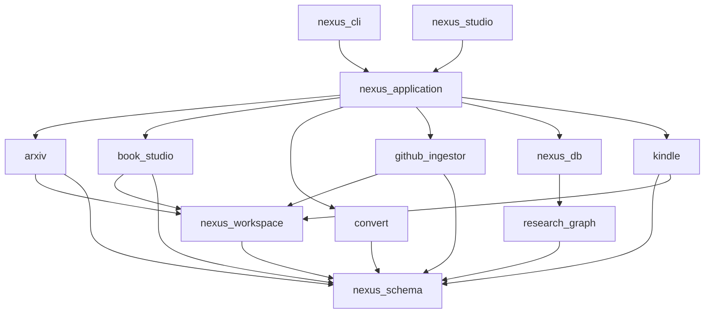

# Nexus Engine v1.0: Scientific Knowledge Engine — Roadmap (Rev. 5)

> **Vision**: A locally-run, offline-capable Scientific Knowledge Engine that ingests academic papers (arXiv), textbooks (PDF), and numerical code (GitHub/Zenodo) into a unified, graph-structured Knowledge Garden — browsable via a native desktop window, exportable to Kindle, and future-proof for RAG.

---

## 1. Guiding Architectural Principles

1. **Hexagonal Architecture (Strict `src`-layout)**: All packages conform to PEP 517 `src`-layout (`packages/<pkg>/src/<pkg>/{domain,services,infra}`) to guarantee isolated, unambiguous namespaces.
2. **Immutable Garden (Content Only)**: Markdown files in `$NEXUS_WORKSPACE/garden/` store only **immutable provenance fields** in YAML.
3. **SQLite is Derived & Rebuildable**: `nexus.db` holds all mutable operational state and can be fully reconstructed from `garden/` YAML files + `ledger/` JSONL files.
4. **Separation of Staging and Publishing**: Intermediate compilation artifacts live in `$NEXUS_WORKSPACE/books/<slug>/`. Final artifacts are published to `$NEXUS_WORKSPACE/garden/`.
5. **Idempotent Operations**: Every pipeline run checks SHA-256 file hashes before processing.

---

## 2. System Architecture

### 2a. Package Dependency Graph (DIP-Compliant UML: A --> B means A imports B)



> [!IMPORTANT]
> `book_studio` and `convert` are siblings coordinated by `nexus_application`. `book_studio` MUST NEVER import `convert` directly.

---

## 3. Data Model

### 3a. SQLite Schema (`nexus_db`)

```sql
PRAGMA foreign_keys = ON;
PRAGMA journal_mode = WAL;

-- 1. Papers Registry
CREATE TABLE papers (
    id          TEXT PRIMARY KEY,
    arxiv_id    TEXT UNIQUE,
    doi         TEXT UNIQUE,
    s2_id       TEXT UNIQUE,
    title       TEXT NOT NULL,
    abstract    TEXT,
    published   DATE,
    venue       TEXT,
    garden_slug TEXT UNIQUE,
    status      TEXT NOT NULL DEFAULT 'stub',
    kindle_sent INTEGER DEFAULT 0,
    citation_count INTEGER,
    file_hash   TEXT,
    created_at  TIMESTAMP DEFAULT CURRENT_TIMESTAMP,
    updated_at  TIMESTAMP DEFAULT CURRENT_TIMESTAMP
);

-- 2. Authors Registry
CREATE TABLE authors (
    id      TEXT PRIMARY KEY,
    name    TEXT NOT NULL,
    s2_id   TEXT UNIQUE
);

CREATE TABLE paper_authors (
    paper_id  TEXT REFERENCES papers(id) ON DELETE CASCADE,
    author_id TEXT REFERENCES authors(id),
    position  INTEGER,
    PRIMARY KEY (paper_id, author_id)
);

-- 3. Citations Graph Edges
CREATE TABLE citations (
    citing_id  TEXT REFERENCES papers(id) ON DELETE CASCADE,
    cited_id   TEXT REFERENCES papers(id) ON DELETE CASCADE,
    source     TEXT NOT NULL,
    confidence REAL DEFAULT 1.0,
    PRIMARY KEY (citing_id, cited_id)
);

-- 4. Repositories
CREATE TABLE repos (
    id         TEXT PRIMARY KEY,
    paper_id   TEXT REFERENCES papers(id),
    zenodo_doi TEXT,
    language   TEXT,
    stars      INTEGER,
    garden_slug TEXT UNIQUE,
    status     TEXT DEFAULT 'stub'
);

-- 5. FTS5 Virtual Table
CREATE VIRTUAL TABLE garden_fts USING fts5(
    paper_id UNINDEXED,
    file_path UNINDEXED,
    section_title,
    body,
    latex_tokens,
    tokenize = "unicode61 remove_diacritics 2 tokenchars '\_^'"
);
```

### 3b. Ledger & Staging Layout (`nexus-workspace`)

```
$NEXUS_WORKSPACE/
├── raw/                      # Immutable inputs (PDFs, tarballs) tracked by DVC
├── books/<slug>/             # Intermediate staging for book_studio
├── ledger/
│   ├── catalog.jsonl         # Stub/metadata registry to satisfy NOT NULL SQLite constraints
│   ├── citations.jsonl       # Append-only edge insertions
│   ├── status.jsonl          # State transitions
│   └── kindle.jsonl          # Kindle delivery states (satisfies kindle_sent flags)
├── garden/                   # Published, Obsidian-ready notes
├── exports/kindle/           # Generated EPUB/MOBI files
└── state/                    # Idempotent workflow ledgers
```

---

## 4. Phased Roadmap

### Sprint 0: Structural Debt Cleanup (Critical Blocker)
| # | Task | Action |
|---|------|--------|
| 0.1 | **Lock Namespace & Promote `research_graph` + Scaffold `nexus_db`** | Extract `research_graph` to top-level `packages/research_graph/src/research_graph/{domain,services,infra}`. Scaffold `nexus_db` with `schema.py`, `repository.py`, `uow.py`. Move `obsidian.py` to `nexus_workspace`. |
| 0.2 | **Deduplicate `packages/arxiv/**` | Diff and merge root vs `src/` and `test/` vs `tests/` across submodules. Archive `api`, `automation`, `front`, and delete root scratch files. |
| 0.3 | **Refactor `book_studio` & `convert`** | Deduplicate `assembler`, `stitcher`, `extractor` in `book_studio/book_studio/` into strict PEP 517 layout. Standardize `app_spatial_compiler`. Delete duplicate `convert/.agents/`. **Enforce boundary: `book_studio` never imports `convert`.** |
| 0.4 | **Align `nexus-workspace` Layout** | Scaffold `garden/`, `raw/`, `ledger/`, `exports/`, `state/`. Keep `books/<slug>/` as staging, publish to `garden/books/<slug>/`. |

*(Sprints 1-7 remain as defined in Rev. 4)*
